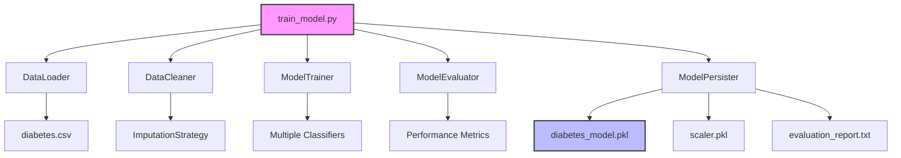

# Design Document: Model Retraining with Data Cleaning

## Overview

This design specifies a reproducible training pipeline for the diabetes prediction model that addresses critical data quality issues in the current implementation. The existing model suffers from two main problems: (1) missing values incorrectly represented as zeros in medical measurements, and (2) version compatibility issues with the serialized model file.

The solution is a standalone Python script (`train_model.py`) that implements a complete ML pipeline: data loading, missing value detection and imputation, feature scaling, multi-model training, model selection, and persistence. The pipeline will produce a more accurate model while maintaining full compatibility with the existing Flask application.

Key design principles:
- Reproducibility through fixed random seeds
- Data leakage prevention through proper train/test splitting
- Backward compatibility with existing Flask app interface
- Comprehensive logging and evaluation reporting

## Architecture

The training pipeline follows a linear workflow with clear separation of concerns:

```
[Data Loading] → [Missing Value Detection] → [Imputation] → [Preprocessing] → [Model Training] → [Evaluation] → [Persistence]
```

### Component Diagram



### Execution Flow

1. **Initialization**: Load configuration (random seeds, file paths, hyperparameters)
2. **Data Loading**: Read CSV, validate schema, log basic statistics
3. **Missing Value Handling**: Identify zeros as missing, apply median imputation
4. **Train/Test Split**: 80/20 stratified split with fixed seed
5. **Feature Scaling**: Fit StandardScaler on training data only
6. **Model Training**: Train multiple classifiers in parallel
7. **Model Selection**: Compare metrics, select best performer
8. **Persistence**: Save model, scaler, and evaluation report
9. **Verification**: Load saved model to confirm compatibility

## Components and Interfaces

### DataLoader

**Responsibility**: Load and validate the diabetes dataset

**Interface**:
```python
class DataLoader:
    def load_data(self, filepath: str) -> pd.DataFrame:
        """Load CSV and validate required columns"""
        
    def validate_schema(self, df: pd.DataFrame) -> bool:
        """Ensure all 8 features + outcome are present"""
        
    def log_statistics(self, df: pd.DataFrame) -> None:
        """Log shape, missing values, class distribution"""
```

**Key Behaviors**:
- Raises `ValueError` if required columns are missing
- Logs dataset shape (expected: 768 rows, 9 columns)
- Logs class distribution (expected: ~500 negative, ~268 positive)

### DataCleaner

**Responsibility**: Detect and impute missing values represented as zeros

**Interface**:
```python
class DataCleaner:
    def __init__(self, features_with_zeros_as_missing: List[str]):
        """Initialize with list of features where 0 = missing"""
        
    def detect_missing(self, df: pd.DataFrame) -> Dict[str, int]:
        """Count zeros in specified features"""
        
    def create_imputer(self, strategy: str = 'median') -> SimpleImputer:
        """Create sklearn imputer with specified strategy"""
        
    def fit_transform(self, X_train: pd.DataFrame) -> Tuple[np.ndarray, SimpleImputer]:
        """Fit imputer on training data and transform"""
        
    def transform(self, X_test: pd.DataFrame, imputer: SimpleImputer) -> np.ndarray:
        """Apply fitted imputer to test data"""
```

**Key Behaviors**:
- Only treats zeros as missing in: Glucose, BloodPressure, SkinThickness, Insulin, BMI
- Preserves zeros in: Pregnancies, Outcome
- Uses median imputation (robust to outliers)
- Logs imputation values for reproducibility


### ModelTrainer

**Responsibility**: Train multiple classification models

**Interface**:
```python
class ModelTrainer:
    def __init__(self, random_state: int = 42):
        """Initialize with random seed for reproducibility"""
        
    def get_candidate_models(self) -> Dict[str, Any]:
        """Return dictionary of model name -> instantiated classifier"""
        
    def train_model(self, model: Any, X_train: np.ndarray, y_train: np.ndarray) -> Any:
        """Fit a single model"""
        
    def train_all(self, X_train: np.ndarray, y_train: np.ndarray) -> Dict[str, Any]:
        """Train all candidate models, return fitted models"""
```

**Candidate Models**:
- RandomForestClassifier (required for compatibility)
- LogisticRegression
- GradientBoostingClassifier
- All with fixed random_state for reproducibility

**Key Behaviors**:
- Logs training start/completion for each model
- Uses consistent random seeds across all models
- Returns dictionary mapping model names to fitted instances

### ModelEvaluator

**Responsibility**: Evaluate models and select the best performer

**Interface**:
```python
class ModelEvaluator:
    def evaluate_model(self, model: Any, X_test: np.ndarray, y_test: np.ndarray) -> Dict[str, float]:
        """Calculate accuracy, precision, recall, F1-score"""
        
    def get_confusion_matrix(self, model: Any, X_test: np.ndarray, y_test: np.ndarray) -> np.ndarray:
        """Generate confusion matrix"""
        
    def select_best_model(self, results: Dict[str, Dict[str, float]]) -> str:
        """Select model with highest accuracy, F1 as tiebreaker"""
        
    def generate_report(self, results: Dict[str, Dict[str, float]], best_model_name: str) -> str:
        """Create formatted evaluation report"""
```

**Metrics Calculated**:
- Accuracy: Overall correctness
- Precision: Positive predictive value
- Recall: Sensitivity
- F1-score: Harmonic mean of precision and recall

**Selection Logic**:
1. Primary criterion: Highest accuracy
2. Tiebreaker: Highest F1-score
3. If still tied: First in alphabetical order

### ModelPersister

**Responsibility**: Save trained model, scaler, and evaluation report

**Interface**:
```python
class ModelPersister:
    def __init__(self, model_dir: str):
        """Initialize with directory for model artifacts"""
        
    def backup_existing_model(self, filepath: str) -> None:
        """Create timestamped backup of existing model"""
        
    def save_model(self, model: Any, filepath: str) -> None:
        """Serialize model using pickle"""
        
    def save_scaler(self, scaler: StandardScaler, filepath: str) -> None:
        """Serialize scaler using pickle"""
        
    def save_report(self, report: str, filepath: str) -> None:
        """Write evaluation report to text file"""
        
    def verify_model_loads(self, filepath: str) -> bool:
        """Attempt to load saved model, return success status"""
```

**File Outputs**:
- `diabetes_model.pkl`: Trained model (or Pipeline containing scaler + model)
- `scaler.pkl`: Fitted StandardScaler (if not in pipeline)
- `model_evaluation_report.txt`: Performance metrics and confusion matrix
- `diabetes_model_backup_YYYYMMDD_HHMMSS.pkl`: Backup of previous model


## Data Models

### Input Data Schema

**Source**: `DiaStagePredict/static/Models/diabetes.csv`

**Schema**:
```python
{
    'Pregnancies': int,          # Number of pregnancies (0-17)
    'Glucose': int,              # Plasma glucose concentration (0-199, 0=missing)
    'BloodPressure': int,        # Diastolic blood pressure (0-122, 0=missing)
    'SkinThickness': int,        # Triceps skin fold thickness (0-99, 0=missing)
    'Insulin': int,              # 2-Hour serum insulin (0-846, 0=missing)
    'BMI': float,                # Body mass index (0.0-67.1, 0.0=missing)
    'DiabetesPedigreeFunction': float,  # Diabetes pedigree function (0.078-2.420)
    'Age': int,                  # Age in years (21-81)
    'Outcome': int               # Class label (0=no diabetes, 1=diabetes)
}
```

**Missing Value Encoding**:
- Features with zeros as missing: Glucose, BloodPressure, SkinThickness, Insulin, BMI
- Features with valid zeros: Pregnancies, Outcome
- Rationale: Medical measurements cannot be zero (e.g., glucose=0 is impossible)

### Model Artifact Schema

**diabetes_model.pkl**:
```python
# Option 1: Pipeline (recommended)
Pipeline([
    ('scaler', StandardScaler()),
    ('classifier', RandomForestClassifier())
])

# Option 2: Standalone model (requires separate scaler.pkl)
RandomForestClassifier(...)
```

**Input Format** (for prediction):
```python
# Shape: (n_samples, 8)
# Order: [Pregnancies, Glucose, BloodPressure, SkinThickness, 
#         Insulin, BMI, DiabetesPedigreeFunction, Age]
np.array([[6, 148, 72, 35, 0, 33.6, 0.627, 50]])
```

**Output Format**:
```python
# Shape: (n_samples,)
# Values: 0 (no diabetes) or 1 (diabetes)
np.array([1])
```

### Configuration Schema

**config.py** (or constants in train_model.py):
```python
CONFIG = {
    'data_path': 'DiaStagePredict/static/Models/diabetes.csv',
    'model_path': 'DiaStagePredict/static/Models/diabetes_model.pkl',
    'scaler_path': 'DiaStagePredict/static/Models/scaler.pkl',
    'report_path': 'DiaStagePredict/static/Models/model_evaluation_report.txt',
    'random_state': 42,
    'test_size': 0.2,
    'features_with_missing_zeros': [
        'Glucose', 'BloodPressure', 'SkinThickness', 'Insulin', 'BMI'
    ],
    'imputation_strategy': 'median',
    'models': {
        'RandomForestClassifier': {'random_state': 42, 'n_estimators': 100},
        'LogisticRegression': {'random_state': 42, 'max_iter': 1000},
        'GradientBoostingClassifier': {'random_state': 42}
    }
}
```

### Evaluation Report Schema

**model_evaluation_report.txt**:
```
Model Evaluation Report
Generated: 2024-01-15 14:30:00
Scikit-learn version: 1.3.0
Random seed: 42

Dataset Statistics:
- Total samples: 768
- Training samples: 614
- Test samples: 154
- Class distribution: {0: 500, 1: 268}

Missing Value Imputation:
- Glucose: 5 zeros replaced with median 117.0
- BloodPressure: 35 zeros replaced with median 72.0
- SkinThickness: 227 zeros replaced with median 23.0
- Insulin: 374 zeros replaced with median 30.5
- BMI: 11 zeros replaced with median 32.0

Model Performance:
┌─────────────────────────┬──────────┬───────────┬────────┬──────────┐
│ Model                   │ Accuracy │ Precision │ Recall │ F1-Score │
├─────────────────────────┼──────────┼───────────┼────────┼──────────┤
│ RandomForestClassifier  │ 0.7792   │ 0.7143    │ 0.6250 │ 0.6667   │
│ LogisticRegression      │ 0.7662   │ 0.6923    │ 0.6000 │ 0.6429   │
│ GradientBoostingClassif │ 0.7727   │ 0.7000    │ 0.6125 │ 0.6538   │
└─────────────────────────┴──────────┴───────────┴────────┴──────────┘

Best Model: RandomForestClassifier

Confusion Matrix (Best Model):
              Predicted
              0    1
Actual  0   [95   5]
        1   [29  25]

Feature Importance (RandomForestClassifier):
1. Glucose: 0.2845
2. BMI: 0.1523
3. Age: 0.1234
4. DiabetesPedigreeFunction: 0.0987
5. BloodPressure: 0.0876
6. Insulin: 0.0765
7. Pregnancies: 0.0654
8. SkinThickness: 0.0543
```


## Correctness Properties

*A property is a characteristic or behavior that should hold true across all valid executions of a system-essentially, a formal statement about what the system should do. Properties serve as the bridge between human-readable specifications and machine-verifiable correctness guarantees.*

### Property Reflection

After analyzing all acceptance criteria, I identified the following redundancies:
- Properties 3.2 and 4.3 both test data leakage prevention (imputer and scaler) - can be combined into one comprehensive property
- Properties 8.1 and 8.4 both test input handling - 8.4 subsumes 8.1 since proper scaling implies correct input format
- Properties 10.1 and 10.4 both test reproducibility - 10.4 is the comprehensive test that implies 10.1

After consolidation, the following properties provide unique validation value:

### Property 1: Schema Validation

*For any* dataset loaded by the pipeline, if any of the required features (Pregnancies, Glucose, BloodPressure, SkinThickness, Insulin, BMI, DiabetesPedigreeFunction, Age, Outcome) are missing, then the pipeline should raise a ValueError with a descriptive message indicating which features are missing.

**Validates: Requirements 1.2, 1.3**

### Property 2: Missing Value Identification

*For any* dataset, zeros in the features [Glucose, BloodPressure, SkinThickness, Insulin, BMI] should be identified as missing values, while zeros in [Pregnancies, Outcome] should be preserved as valid data.

**Validates: Requirements 2.1, 2.4**

### Property 3: Missing Value Percentage Calculation

*For any* dataset with known counts of zero values in specified features, the calculated percentage of missing values should equal (count_of_zeros / total_rows) * 100 for each feature.

**Validates: Requirements 2.2**

### Property 4: Median Imputation

*For any* feature with missing values, after imputation, all previously missing values should be replaced with the median of the non-missing values from that feature in the training set.

**Validates: Requirements 3.1**


### Property 5: Data Leakage Prevention

*For any* dataset split into training and test sets, both the imputer and scaler should be fit using only the training set, and then the same fitted transformers should be applied to both training and test sets.

**Validates: Requirements 3.2, 3.3, 4.3**

### Property 6: Feature Scaling Correctness

*For any* training dataset after scaling, the mean of each feature should be approximately 0 (within 1e-7) and the standard deviation should be approximately 1 (within 1e-7).

**Validates: Requirements 4.2**

### Property 7: Reproducible Splits

*For any* dataset, when split twice using the same random seed, the resulting training and test sets should be identical (same samples in same order).

**Validates: Requirements 4.5, 10.1**

### Property 8: Model Evaluation Completeness

*For any* trained model, the evaluation results should contain all four metrics: accuracy, precision, recall, and F1-score, and each metric should be a float between 0 and 1.

**Validates: Requirements 5.3, 5.4**

### Property 9: Best Model Selection

*For any* set of model evaluation results, the selected best model should be the one with the highest accuracy, or if multiple models have equal accuracy, the one with the highest F1-score.

**Validates: Requirements 5.5, 5.6 (edge case)**

### Property 10: Model Persistence Round-Trip

*For any* trained model, after saving to disk and loading back, the loaded model should produce identical predictions on the same input data as the original model.

**Validates: Requirements 6.5**

### Property 11: Input Format Compatibility

*For any* valid input array with shape (n_samples, 8) containing the features in the correct order, the model should accept the input and return predictions without errors, and the predictions should be in the set {0, 1}.

**Validates: Requirements 8.1, 8.2, 8.4**


### Property 12: Error Handling

*For any* operation that fails during pipeline execution (e.g., file not found, invalid data), the pipeline should raise an appropriate exception with a descriptive error message rather than failing silently or with a generic error.

**Validates: Requirements 9.4**

### Property 13: End-to-End Reproducibility

*For any* dataset, when the complete training pipeline is executed multiple times with the same random seed and configuration, the resulting performance metrics (accuracy, precision, recall, F1-score) should be identical across all runs.

**Validates: Requirements 10.4**

## Error Handling

The training pipeline implements comprehensive error handling at each stage:

### Data Loading Errors

**Scenarios**:
- File not found: `FileNotFoundError` with path
- Invalid CSV format: `pd.errors.ParserError` with details
- Missing required columns: `ValueError` listing missing columns
- Empty dataset: `ValueError` indicating no data

**Recovery**: None - these are fatal errors that prevent training

### Data Quality Errors

**Scenarios**:
- All values missing in a feature: `ValueError` indicating which feature
- Invalid data types: `TypeError` with expected vs actual types
- Outcome column not binary: `ValueError` indicating invalid values

**Recovery**: None - data must be corrected at source

### Training Errors

**Scenarios**:
- Model fails to converge: Log warning, continue with other models
- Insufficient memory: `MemoryError` with suggestion to reduce data or model complexity
- Invalid hyperparameters: `ValueError` from sklearn with parameter details

**Recovery**: For convergence warnings, continue training; for fatal errors, abort

### Persistence Errors

**Scenarios**:
- Insufficient disk space: `OSError` with space requirements
- Permission denied: `PermissionError` with file path
- Model fails to load after saving: `pickle.UnpicklingError` with details

**Recovery**: For backup failures, log warning and continue; for save failures, abort


### Logging Strategy

All errors are logged with:
- Timestamp
- Error type and message
- Stack trace (for unexpected errors)
- Context (which step failed, what data was being processed)

## Testing Strategy

The testing strategy employs both unit tests and property-based tests to ensure comprehensive coverage and correctness.

### Unit Testing Approach

Unit tests focus on specific examples, edge cases, and integration points:

**Data Loading Tests**:
- Test loading the actual diabetes.csv file
- Test error handling for missing file
- Test error handling for malformed CSV
- Test schema validation with missing columns

**Data Cleaning Tests**:
- Test missing value detection on sample data
- Test that zeros in Pregnancies/Outcome are preserved
- Test median imputation with known values
- Test percentage calculation with known counts

**Model Training Tests**:
- Test that at least 3 models are trained
- Test that RandomForestClassifier is included
- Test model training with small sample dataset

**Model Evaluation Tests**:
- Test metric calculation with known predictions
- Test best model selection with mock results
- Test tiebreaker logic (equal accuracy, different F1)
- Test confusion matrix generation

**Model Persistence Tests**:
- Test saving and loading model
- Test backup creation when model exists
- Test report file generation
- Test that saved model works with Flask app input format

**Integration Tests**:
- Test complete pipeline execution end-to-end
- Test that output files are created in correct locations
- Test reproducibility (run twice, compare outputs)

### Property-Based Testing Approach

Property-based tests verify universal properties across many generated inputs using Hypothesis (Python's PBT library):

**Configuration**: Each property test runs minimum 100 iterations

**Test Tagging**: Each test includes a comment:
```python
# Feature: model-retraining-with-data-cleaning, Property 1: Schema Validation
```


**Property Test Specifications**:

1. **Schema Validation Property** (Property 1):
   - Generate: Random dataframes with various column combinations
   - Test: Missing required columns raises ValueError
   - Strategy: Use Hypothesis to generate column name lists, create dataframes

2. **Missing Value Identification Property** (Property 2):
   - Generate: Random dataframes with zeros in various columns
   - Test: Zeros correctly identified as missing only in specified features
   - Strategy: Generate data with controlled zero placement

3. **Missing Value Percentage Property** (Property 3):
   - Generate: Random dataframes with known zero counts
   - Test: Calculated percentages match expected values
   - Strategy: Generate data, calculate expected percentage, verify

4. **Median Imputation Property** (Property 4):
   - Generate: Random datasets with missing values
   - Test: Imputed values equal median of non-missing training values
   - Strategy: Generate data, compute expected median, verify imputation

5. **Data Leakage Prevention Property** (Property 5):
   - Generate: Random train/test splits
   - Test: Imputer and scaler statistics computed only from training data
   - Strategy: Verify fitted parameters don't match full dataset statistics

6. **Feature Scaling Property** (Property 6):
   - Generate: Random numerical datasets
   - Test: Scaled training data has mean≈0, std≈1
   - Strategy: Scale data, compute statistics, verify within tolerance

7. **Reproducible Splits Property** (Property 7):
   - Generate: Random datasets and random seeds
   - Test: Same seed produces identical splits
   - Strategy: Split twice with same seed, compare results

8. **Model Evaluation Completeness Property** (Property 8):
   - Generate: Random predictions and true labels
   - Test: All four metrics present and in valid range [0,1]
   - Strategy: Generate predictions, compute metrics, verify completeness

9. **Best Model Selection Property** (Property 9):
   - Generate: Random model evaluation results
   - Test: Selected model has highest accuracy (or F1 if tied)
   - Strategy: Generate results with known best model, verify selection

10. **Model Persistence Round-Trip Property** (Property 10):
    - Generate: Random trained models and input data
    - Test: Predictions identical before and after save/load
    - Strategy: Train model, save, load, compare predictions

11. **Input Format Compatibility Property** (Property 11):
    - Generate: Random valid input arrays (n_samples, 8)
    - Test: Model accepts input and returns predictions in {0,1}
    - Strategy: Generate inputs, verify predictions are binary

12. **Error Handling Property** (Property 12):
    - Generate: Various invalid inputs (wrong types, missing files, etc.)
    - Test: Appropriate exceptions raised with descriptive messages
    - Strategy: Inject failures, verify exception types and messages

13. **End-to-End Reproducibility Property** (Property 13):
    - Generate: Random datasets and random seeds
    - Test: Multiple runs with same seed produce identical metrics
    - Strategy: Run pipeline twice, compare all metrics

### Test Organization

```
tests/
├── unit/
│   ├── test_data_loader.py
│   ├── test_data_cleaner.py
│   ├── test_model_trainer.py
│   ├── test_model_evaluator.py
│   └── test_model_persister.py
├── integration/
│   └── test_pipeline_integration.py
└── property/
    ├── test_properties_data.py
    ├── test_properties_training.py
    └── test_properties_persistence.py
```

### Testing Dependencies

```python
# requirements-test.txt
pytest>=7.0.0
hypothesis>=6.0.0
pytest-cov>=4.0.0
```

### Coverage Goals

- Unit test coverage: >90% of code
- Property test coverage: All 13 correctness properties
- Integration test coverage: Complete pipeline execution paths
- Edge case coverage: All identified edge cases (tiebreakers, empty data, etc.)

